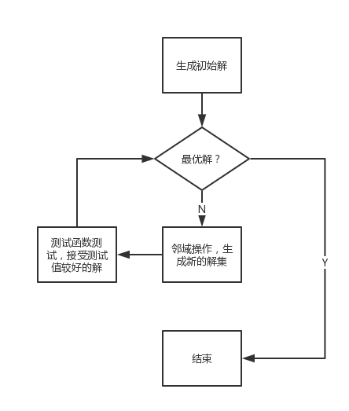
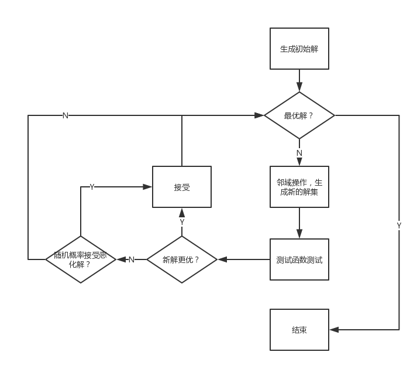
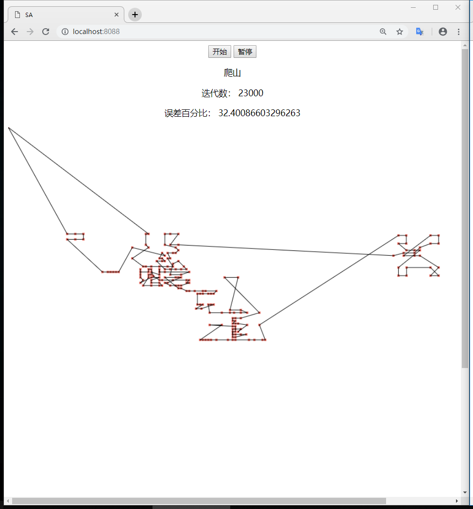
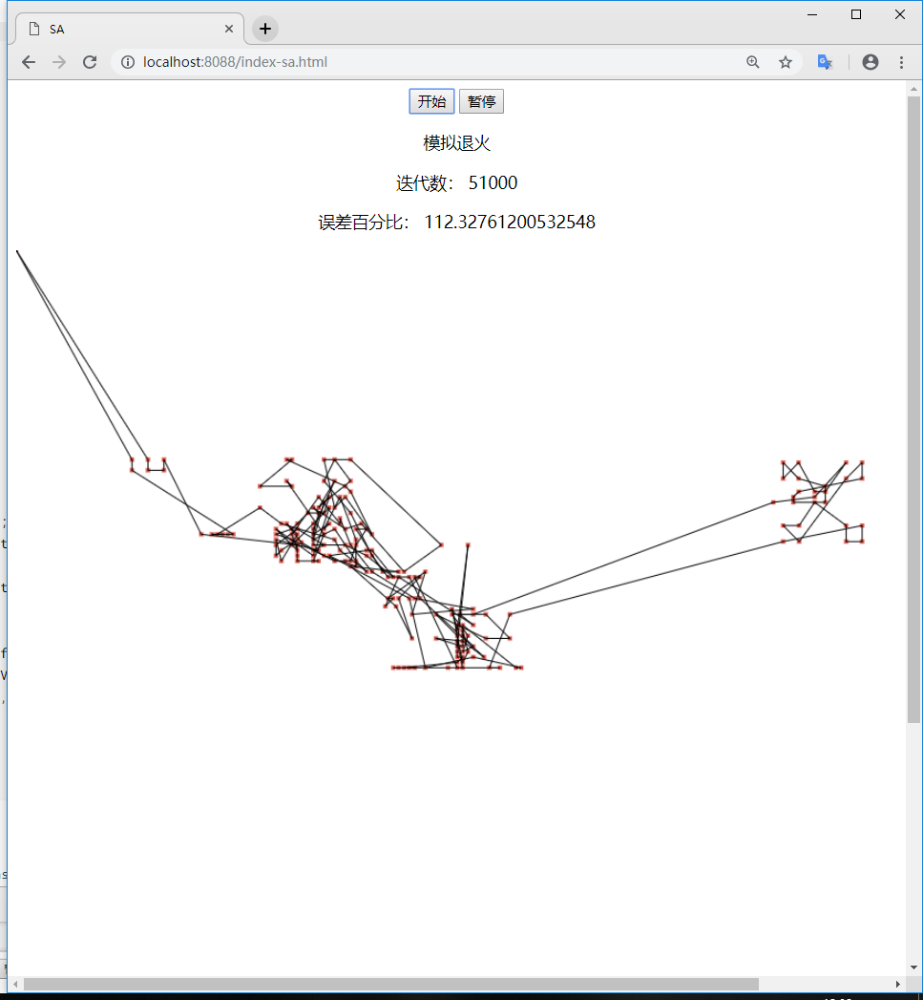
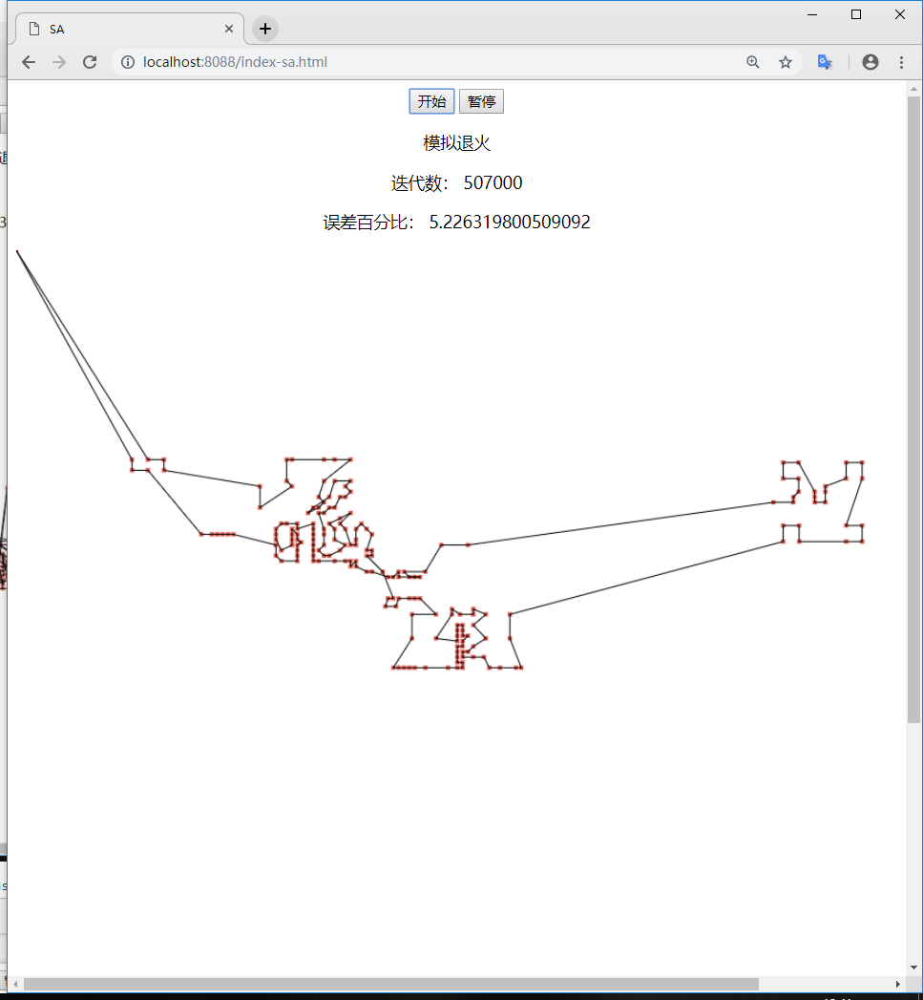
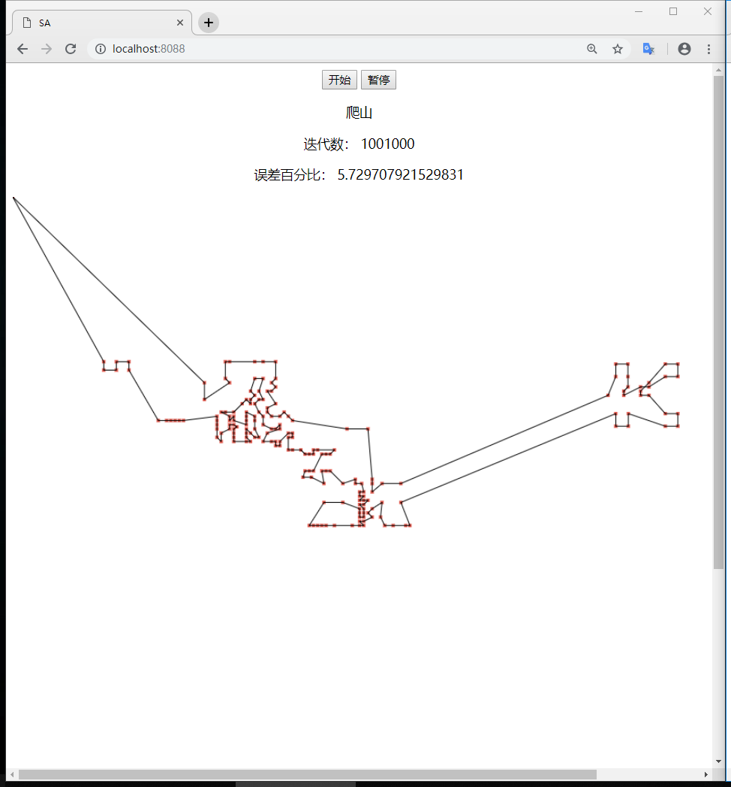
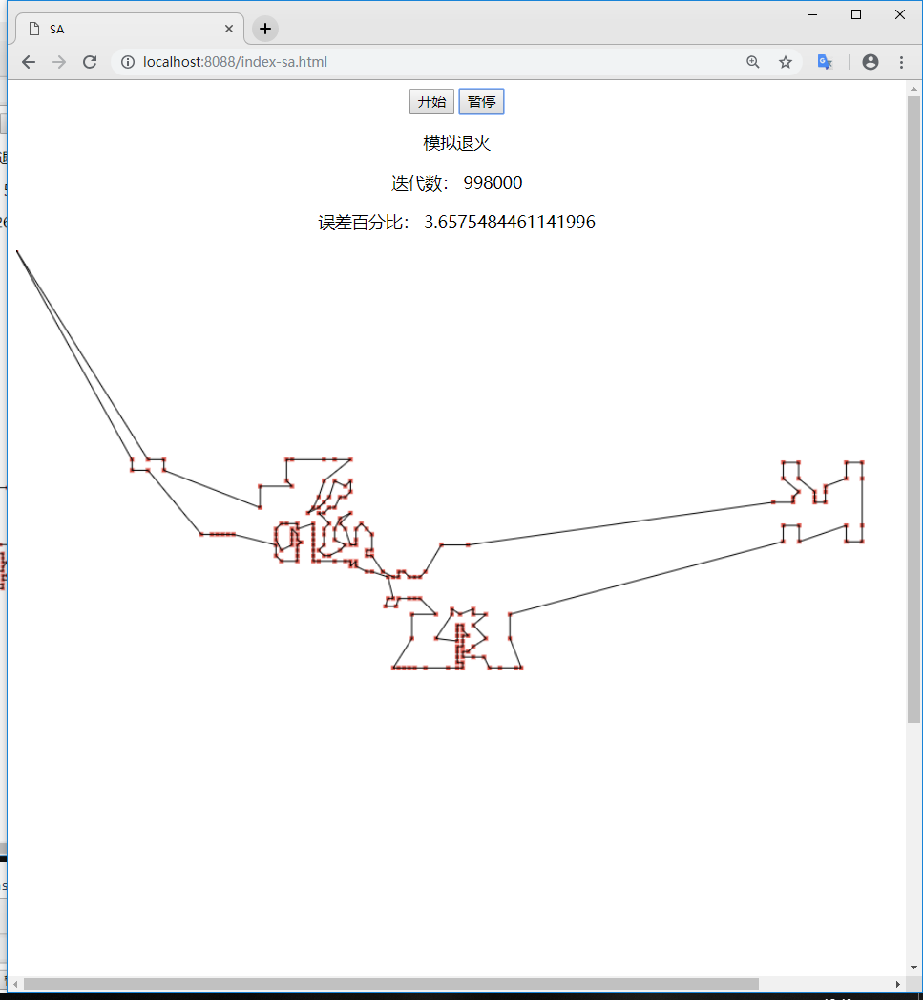

## AI | SA模拟退火解决TSP问题

1.     采用多种邻域操作的局部搜索local search策略求解
2.     在局部搜索策略的基础上，加入模拟退火simulated annealing策略，并比较两者的效果

### 数据

在[TSPLIB](http://comopt.ifi.uni-heidelberg.de/software/TSPLIB95/)中选一个大于100个城市数的TSP问题，本次选取的数据集`d198.tsp`。

### 实验环境

语言：`Golang`

可视化：`js`+`html`

### 局部搜索

局部搜索是解决**最优化问题**的一种**启发式算法**。对于某些计算起来非常复杂的最优化问题，比如各种NP完全问题，要找到最优解需要的时间随问题规模呈指数增长，因此诞生了各种启发式算法来退而求其次寻找次优解，是一种近似算法（Approximate algorithms），以时间换精度的思想。局部搜索就是其中的一种方法。

局部搜索的基本步骤如下：

（1）生成第一个可能的解。若是目标则停止，否则转到下一步

（2）从当前解出发，生成新的可能的解集；用测试函数测试新的可能解集中的元素，若是解，则停止；否则将它与当前最优解比较，若更接近解，则保留作为最优解，否则丢弃。

（3）以当前最优元素为起点，转到（2）



局部搜索最主要的操作就是邻域操作，本次实验使用了两种邻域操作：

* 2-opt：在当前路径path中任意取两点，将两点间的路径逆序。
* 在当前路径中任取三点，将路径分为四段，把第二段调整到第三段后。

代码如下：

```go
func twoOpt() (newPath nodePath) {
	r := rand.New(rand.NewSource(time.Now().UnixNano()))
	// println(cityNum - 1)
	start := r.Intn(cityNum - 1)
	end := start + r.Intn(cityNum-1-start)
	// 第一段不变
	newPath = make(nodePath, cityNum)
	copy(newPath, path[:start])
	// 第二段反转
	for i := 0; i <= end-start; i++ {
		newPath[start+i] = path[end-i]
	}
	// 第三段不变
	for i := end + 1; i < cityNum; i++ {
		newPath[i] = path[i]
	}
	return newPath
}

func threeChange() (newPath nodePath) {
	r := rand.New(rand.NewSource(time.Now().UnixNano()))
	start := r.Intn(cityNum - 1)
	middle := start + r.Intn(cityNum-1-start)
	end := middle + r.Intn(cityNum-1-middle)
	// 第一段不变
	newPath = make(nodePath, cityNum)
	for i := 0; i < start; i++ {
		newPath[i] = path[i]
	}
	// 第二段第三段交换
	count := 0
	for i := 0; i <= end-middle; i++ {
		newPath[start+i] = path[middle+i]
		count = start + i
	}
	for i := 0; i < middle-start; i++ {
		newPath[count+1+i] = path[start+i]
	}
	// 第四段不变
	for i := end + 1; i < cityNum; i++ {
		newPath[i] = path[i]
	}
	return newPath
}
```

以上两种邻域操作同时使用，在生成的两种解中，挑选出测试值比较好（路径短）的那个解。

### SA-模拟退火算法

在局部搜索的基础上，使用`Metropolis`准则，基本步骤如下：

（1）设定初温`T`，降温系数`q`，终止温度`T_end`，生成第一个可能的解。若是目标则停止，否则转到下一步

（2）从当前解出发，生成新的可能的解集；用测试函数测试新的可能解集中的元素，若是解，则停止；否则将它与当前最优解比较，若更接近解，则保留作为最优解；否则使用`Metropolis`准则，计算新解与最优解的之间的能量变化`E`，变化后的状态可采纳的概率为`P = Exp(-E/T)`，然后随机在（0,1）区间内取一个数`R`，若`R<P`，则接受恶化解作为当前最优元素。

（3）若`T`>`T_end`，则以当前最优元素为起点，转到（2）。否则算法结束。



本次实验中，初温`T=1000.0`，降温系数`q`会随温度而变化，在温度高的时候降温会比较快，温度低的时候降温比较慢，这样算法收敛的速度会更快。

代码如下：

```go
func sa() func() {
	n := 0
	T := 1000.0
	L := 1000
	global := js.Global()
	currentDis := distance(path)
	r := rand.New(rand.NewSource(time.Now().UnixNano()))

	return func() {
		if T > tEnd {
			if T > 100 {
				q = 0.9
			} else {
				q = 0.99
			}
			for i := 0; i < L; i++ {
				newPath := twoOpt()
				newPath1 := threeChange()
				dis := distance(newPath)
				dis1 := distance(newPath1)
				if dis > dis1 {
					dis = dis1
					newPath = newPath1
				}
				df := dis - currentDis
				// Metropolis准则
				if df < 0 {
					// 接受新解
					currentDis = dis
					path = newPath
				} else {
					R := r.Float64()
					P := math.Exp(-df / T)
					// 接受恶化解
					if R < P {
						currentDis = dis
						path = newPath
					}
				}
				n++
			}
			T *= q
			var nodeX strings.Builder
			var nodeY strings.Builder
			for nodeXY := 0; nodeXY < len(path); nodeXY++ {
				nodeX.WriteString(strconv.FormatFloat(path[nodeXY].x, 'g', 10, 64))
				nodeX.WriteByte(',')
				nodeY.WriteString(strconv.FormatFloat(path[nodeXY].y, 'g', 10, 64))
				nodeY.WriteByte(',')
			}
			global.Call("updateNode", js.ValueOf(n), js.ValueOf((currentDis-15780)/15780*100),
				js.ValueOf(nodeX.String()), js.ValueOf(nodeY.String()))
			// fmt.Printf("迭代数: %v, %.2f%%\n", n, (currentDis-15780)/15780*100)
		}
	}

}
```

### 实验测试截图

| 局部搜索                                      | SA                                            |
| --------------------------------------------- | --------------------------------------------- |
|  |  |
|  |  |
|  |  |

### 实验分析

**收敛速度**

迭代初期：

* 局部搜索：收敛速度快
* SA：收敛速度慢，温度高时，跳出局部最优概率大，接受恶化解的概率大。

迭代中期：

* 局部搜索：收敛速度变慢，并且逐渐陷入局部最优，但是2-opt和自定义的邻域操作对其进行了扰动，有一定概率可以跳出局部最优，但概率非常小。
* SA：温度下降，接收恶化解的概率下降，收敛速度开始加快。

迭代后期：

* 局部搜索：很大概率会陷入局部最优，与最优解的误差百分比变化非常缓慢。
* SA：由于有概率接受恶化解，可以跳出局部最优，因此还是会继续生成新的好的解，因此误差逐渐超过局部搜索。

**交叉程度**

可以看出到最后，SA的交叉程度比较低，生成的解的误差也比局部搜索的小。

### 整体实验分析

一共测试了10次，每次迭代1000000次，最后生成的误差如下：

| 局部搜索（%） | SA（%） |
| ------------- | ------- |
| 7.1           | 3.2     |
| 6.5           | 2.1     |
| 3.5           | 3.9     |
| 9.5           | 5.5     |
| 7.5           | 4.3     |
| 8.4           | 6.5     |
| 9.6           | 5.6     |
| 4.6           | 1.8     |
| 8.8           | 2.4     |
| 6.6           | 3.8     |

可以看到，两个算法的误差都能很稳定的跑进10%，但是整体上SA的误差会更小，而局部搜索误差进入15%内所需要的迭代步数更少，这十次实验中只有一次局部搜索的误差比SA的更小。

